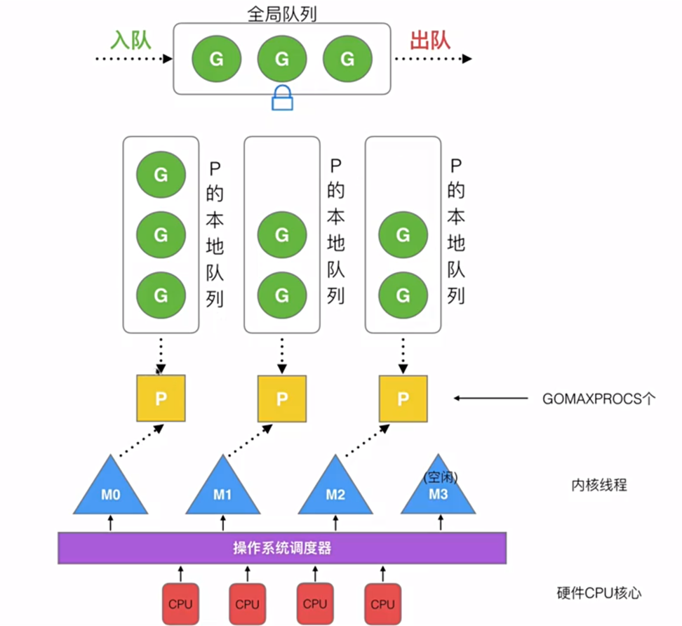

## Golang 知识点

### Golang 如何支持高并发？

1）采用的轻量级线程和CSP模型的并发模型，确保了数据的安全传递和协调操作

在Golang中，goroutine是一种开销很小的执行单元，可以在一个或多个线程上运行。与传统的线程相比，goroutine的创建和销毁都非常快速，且占用的资源相对较少。这意味着可以非常容易地创建成千上万个goroutine，而不会带来明显的性能开销。此外，goroutine之间通过Channel进行通信，这是一种基于CSP模型的通信机制，确保了数据的安全传递和协调操作。这种轻量级的并发模型使得Golang能够高效地实现并发编程，极大地简化了编写并发代码的复杂性。

2）提供了强大的并发相关工具和原语，进一步增强了其并发编程能力

Golang提供了goroutine的调度器，能够自动将goroutine映射到可用的线程上，并根据情况动态调整线程的数量。这使得开发者无需手动管理线程的创建和销毁，充分发挥了Golang的自动化特性。此外，Golang还提供了诸如锁、条件变量、原子操作等同步机制，以及内置的并发安全的数据结构，如通道（Channel）、互斥锁（Mutex）等，供开发者使用。这些工具和原语的存在，使得开发者能够更方便地实现并发控制和数据共享，减少了错误的可能性。

3）高效的垃圾回收机制，减少了垃圾回收对并发性能的影响。

Golang采用了一种名为“并发垃圾回收（concurrent garbage collection）”的回收方式，它能够与程序的执行并行进行，减少了垃圾回收对程序的停顿时间。这意味着在Golang中，垃圾回收的执行对并发性能的影响更小，允许程序在进行垃圾回收的同时继续执行其他任务，从而提高了并发性能。

### GMP 调度模型

在当前P(处理器)上创建G(groutine)后 , 会把G放入P的本地队列或者全局队列 , 本地队列限制256个 , 满了就放全局队列

 在当前P(处理器)创建或者唤醒M(系统线程) , 去事件循环执行G(groutine)

 在当前P(处理器)上如果全局/本地队列为空 , 会去从别的处理器上窃取一半的G拿来执行

P 的数量受环境变量 GOMAXPROCS 的直接影响 , 一般设置为当前机器的内核数

M 的数量默认限制是10000 , 超出会报错

G 的数量一般没有限制 ,理论上受内存影响

### Go 的 slice 底层数据结构和一些特性

Slice = 指向底层数组的头指针，和长度len，以及容量。

扩容思路：对于 append 向 slice 添加元素时，若 slice 容量够用，则追加新元素进去，slice.len++，返回原来的 slice。当原容量不够，则 slice 先扩容，扩容之后 slice 得到新的 slice，将元素追加进新的 slice，slice.len++，返回新的 slice。

扩容规则：当切片比较小时（容量小于 1024），采用较大的扩容倍速进行扩容（新的扩容会是原来的2倍，避免频繁扩容，从而减少内存分配的次数和数据拷贝的代价。当切片较大的时，（原来的 slice 的容量大于或者等于 1024），采用较小的扩容倍速（新的扩容将扩大大于或者等于原来 1.25 倍），主要避免空间浪费（网上其实很多总结的是 1.25 倍，那是在不考虑内存对齐的情况下，实际上还要考虑内存对齐，扩容是大于或者等于 1.25 倍）。

